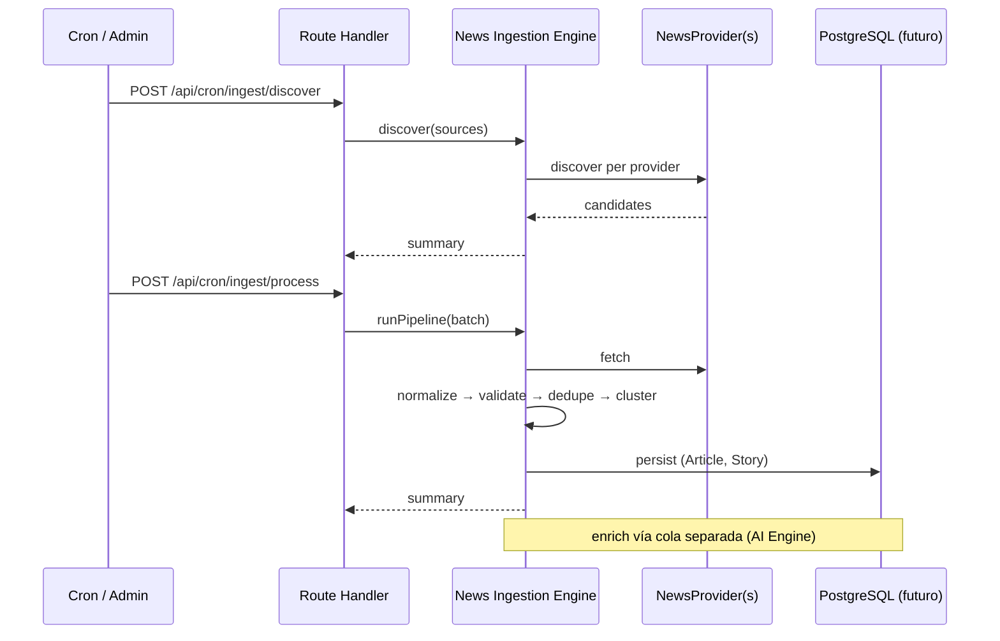

# API — Veraz

> Estado: **planificado**. Sin Route Handlers ni consumo de APIs externas.
>
> Los recursos HTTP reflejan el **dominio** (`docs/domain.md`), no tablas SQL.
>
> Ingesta: diseño en [`docs/news-ingestion-engine.md`](./news-ingestion-engine.md) — sin endpoints implementados.

## Superficies previstas

| Superficie | Uso |
|------------|-----|
| Server Components / loaders | Lectura de feed y detalle (preferido) |
| Server Actions | Mutaciones autenticadas (bookmarks, settings) |
| Route Handlers (`src/app/api`) | Cron, webhooks, API pública versionada |
| Jobs / Cron | **Ingesta** vía News Ingestion Engine (**núcleo**) |
| Jobs / Cron (opcional) | Persistencia de `AIAnalysis` vía AI Engine |
| Admin (interno) | Reproceso ingesta, DLQ, pausar Source/provider |

## Principios

1. Validar inputs en el boundary (p. ej. Zod cuando se introduzca).
2. No exponer `service_role` ni secrets al cliente.
3. Rate limiting en endpoints sensibles.
4. Errores tipados; sin filtrar internals.
5. Lectura de noticias **no** depende de proveedores de IA **ni** del éxito de un job de ingesta puntual.
6. Enrichment solo a través del AI Engine.
7. Ingesta solo a través del News Ingestion Engine — **nunca** RSS/API directo desde Route Handlers.
8. DTOs de API **mapean** entidades de dominio; no filtrar ORM/SQL al cliente.
9. Recursos de IA ausentes ⇒ `null` / omitidos, nunca 5xx por IA off.
10. Fallo de un provider de ingesta ⇒ otros providers siguen; lectura pública intacta.

## Mapa dominio → recursos (borrador)

| Dominio | Recurso API tentativo |
|---------|------------------------|
| Article | `GET /api/v1/articles`, `GET /api/v1/articles/:slug` |
| Source | `GET /api/v1/sources` |
| Category / Topic / Tag | `GET /api/v1/categories`, `/topics`, `/tags` |
| Country / Language | catálogos `GET /api/v1/countries`, `/languages` |
| Story | `GET /api/v1/stories/:slug` (+ articles, timeline) |
| RelatedArticle | embebido en detalle de article o `?include=related` |
| Media / Reference | embebidos en article |
| TimelineEvent | embebido en story |
| AIAnalysis | embebido opcional `article.analysis` |
| Bookmark | `GET/POST/DELETE /api/v1/bookmarks` (auth) |
| Notification | `GET /api/v1/notifications` (auth) |
| UserPreference | `GET/PATCH /api/v1/me/preferences` |
| PremiumSubscription | `GET /api/v1/me/subscription` |

## News Ingestion Engine y API

La ingesta **no** expone formatos de proveedores al cliente. Solo jobs internos protegidos invocan el Engine.

### Jobs / cron (borrador)

| Endpoint / trigger | Rol | Auth |
|--------------------|-----|------|
| `POST /api/cron/ingest/discover` | Descubrimiento por Source/provider | Cron secret |
| `POST /api/cron/ingest/process` | Procesar cola (fetch → publish) | Cron secret |
| `POST /api/cron/ingest/reprocess` | Reintentar DLQ / ítem atascado | Cron secret + admin |
| `POST /api/cron/ingest/publish` | Promover `ready` → `published` | Cron secret |
| Webhook `POST /api/webhooks/ingest/:providerId` | Push de provider (futuro) | Firma provider |

Parámetros tentativos (query/body): `sourceId?`, `providerId?`, `country?`, `language?`, `limit?`, `since?`.

**Respuesta:** resumen operativo (`processed`, `skipped`, `failed`, `byProvider`), no payloads crudos.

### Admin (borrador)

| Recurso | Uso |
|---------|-----|
| `GET /api/admin/ingest/status` | Salud por provider, lag de cola |
| `GET /api/admin/ingest/dlq` | Ítems fallidos |
| `POST /api/admin/ingest/dlq/:id/retry` | Reintento manual |
| `PATCH /api/admin/sources/:id` | Pausar/reanudar Source |

### Flujo HTTP (conceptual)



### Contratos de respuesta (operativos, no dominio)

```ts
type IngestJobSummary = {
  runId: string;
  startedAt: string;
  finishedAt: string;
  providers: Array<{
    providerId: string;
    discovered: number;
    fetched: number;
    normalized: number;
    rejected: number;
    duplicates: number;
    persisted: number;
    failed: number;
    errors: Array<{ code: string; count: number }>;
  }>;
};
```

Los clientes públicos **nunca** reciben `ProviderPayload` ni `NormalizedArticle`.

## Contratos de lectura (borrador semántico)

### Feed

Filtros de dominio: `category`, `topic`, `tag`, `country`, `language`, `source`, cursor/página, `status=published`.

Respuesta: lista de Article summaries (**sin** requerir AIAnalysis).

### Article detail

Article + Source attribution + Categories/Topics/Tags + Media + References  
+ RelatedArticle[] opcional  
+ `analysis: AIAnalysis | null`  
+ Stories vinculadas (ids/slugs)

### Story detail

Story + StoryArticle[] + TimelineEvent[] + Sources involucradas (derivado).

## Mutaciones autenticadas (borrador)

- Bookmark create/delete
- Preference patch
- Notification mark-read
- (Premium) portal de billing — infra de pagos, no dominio puro

## AI Engine y API

```
Job enrich
  → AI Engine
  → map resultado → AIAnalysis (dominio)
  → persist (infra)
```

Si Engine disabled/fail → article endpoints intactos.

### Separación de colas

| Cola | Invocación tentativa | Depende de |
|------|----------------------|------------|
| Ingesta | `/api/cron/ingest/*` | News Ingestion Engine |
| Enrichment | `/api/cron/enrich` | AI Engine |

La publicación de un artículo **no** espera a ninguna de las dos colas.

## Ingest job (referencia rápida)

| Job | Endpoint tentativo |
|-----|-------------------|
| Ingest discover | `POST /api/cron/ingest/discover` |
| Ingest process | `POST /api/cron/ingest/process` |
| Enrich | `POST /api/cron/enrich` (fail-open) |

## Versionado

API pública: `/api/v1`. Server Actions internos sin versionado HTTP.  
Jobs de ingesta: rutas `/api/cron/*` sin versionado (internas).
