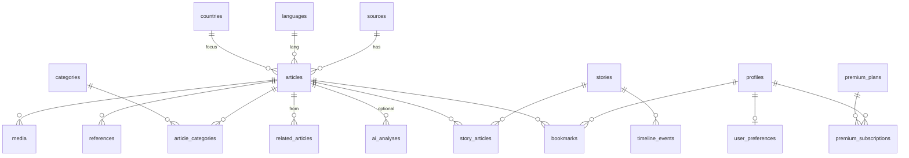

# Base de datos — Veraz

> Estado: **schema inicial implementado** para `sources`, `articles`, `media`, `article_references`.
> Migraciones: `supabase/migrations/20250717000000_initial_content_schema.sql`, `20250719180000_enable_rls_public_read.sql`.
> Repositorios activos: `ArticleRepository`, `SourceRepository` (Supabase, service role).
>
> Este documento describe el **mapeo futuro** dominio → persistencia.
> El modelo conceptual vive en [`docs/domain.md`](./domain.md).
> Contratos tipados: `src/domain/`.

## Motor previsto

PostgreSQL vía **Supabase**, con Row Level Security (RLS) para datos de usuario.

## Principio de mapeo

| Dominio | Persistencia (nombre tentativo) | Notas |
|---------|----------------------------------|-------|
| Source | `sources` | |
| Article | `articles` | agregado raíz; válido sin insights |
| Category | `categories` | árbol vía `parent_id` |
| Topic | `topics` | |
| Tag | `tags` | |
| Country | `countries` | catálogo ISO |
| Language | `languages` | catálogo BCP-47 |
| ArticleCategory | `article_categories` | N:N |
| ArticleTopic | `article_topics` | N:N |
| ArticleTag | `article_tags` | N:N |
| Story | `stories` | cluster de hecho real |
| StoryArticle | `story_articles` | N:N + role |
| Media | `media` | |
| Reference | `article_references` | mapeo dominio `Reference` |
| TimelineEvent | `timeline_events` | FK → stories |
| RelatedArticle | `related_articles` | aristas tipadas |
| AIAnalysis | `ai_analyses` | **opcional**; 0..N por article |
| UserProfile | `profiles` | alineado a auth.uid |
| UserPreference | `user_preferences` | 1:1 |
| Bookmark | `bookmarks` | unique (user, article) |
| Notification | `notifications` | |
| PremiumPlan | `premium_plans` | |
| PremiumSubscription | `premium_subscriptions` | |

No se generan migraciones adicionales en esta fase salvo hardening de seguridad (RLS baseline).

## Diagrama de persistencia (conceptual)

## Separación dominio / infra

- El dominio **no** define columnas SQL, índices ni RLS.
- Repositorios en `src/lib/repositories/` traducen `Article` ↔ fila.
- Storage keys de Media, auth subjects y billing IDs son concerns de infra.

## Principios de datos

1. Preferir URL + excerpt + atribución; no cuerpo completo sin licencia.
2. `articles` son válidos **sin** filas en `ai_analyses`.
3. Todo analysis factual debe poder citar fuentes (`source_refs`).
4. Contenido público: RLS read-only (`articles.status = 'published'`, `sources.status = 'active'`) — ver [`docs/security.md`](./security.md).
5. Datos de usuario: RLS estricta (`auth.uid()`).
6. `service_role` solo en server/jobs.
7. Fallos de IA no revierten un article ya insertado.
8. Dedupe: unique en `articles.url_fingerprint` (implementado).

## Índices implementados

- `articles(url_fingerprint)` unique
- `articles(source_id, published_at desc)`
- `articles(status, published_at desc)`
- `sources(slug)` unique
- `media(article_id)`, `article_references(article_id)`

## Índices previstos (fases posteriores)

- `articles(status, published_at desc)`
- `articles(source_id, published_at desc)`
- `articles(url_fingerprint)` unique parcial
- `articles` FTS (title + excerpt)
- `story_articles(story_id)`, `story_articles(article_id)`
- `bookmarks(user_id, article_id)` unique
- `ai_analyses(article_id, version)`
- `notifications(user_id, status, created_at desc)`

## Particionado / escala (evolución)

- Particionar o archivar `articles` por tiempo cuando el volumen lo exija.
- Read models / materializadas para feed (fuera del modelo de dominio puro).
- Search engine dedicado (Fase 3) indexa proyecciones, no redefine el dominio.

## Migraciones

Viven en `supabase/migrations/`. Aplicar con la CLI de Supabase antes de persistir en entorno local/staging.
