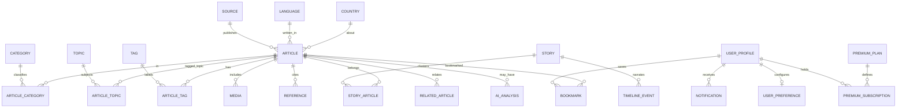

# Dominio de negocio — Veraz

> Estado: **diseño conceptual**. Sin migraciones, sin repositorios, sin lógica de aplicación.
>
> Contratos tipados (solo tipos): `src/domain/`.
> Persistencia futura: ver `docs/database.md` (mapeo, no schema ejecutado).

## 1. Principios del dominio

1. **Núcleo = noticias verificables.** Una `Article` es válida sin IA, sin Premium y sin usuario logueado.
2. **Trazabilidad.** Todo claim enriquecido apunta a `Source` / `Reference` reales.
3. **IA opcional.** `AIAnalysis` es satélite: 0..N por artículo; su ausencia no invalida el contenido.
4. **Identidad estable.** IDs opacos (`ArticleId`, …); slugs solo para UX/SEO y pueden cambiar con redirect.
5. **Multilingüe y multi-país desde el día 0** en el modelo (aunque el MVP publique un subconjunto).
6. **Contenido multi-formato.** Texto, imagen, video, audio vía `Media` + `ContentFormat`.
7. **El dominio no conoce infraestructura.** Cero imports de Supabase, HTTP, AI Engine SDKs o UI.
8. **Dedupe y clustering son de primer nivel.** Fingerprints en `Article`; hechos del mundo real en `Story`.
9. **Ingesta desacoplada.** Formatos externos (RSS, APIs) viven en `lib/news-ingestion`; el dominio solo recibe entidades ya normalizadas al persistir.

## 2. Bounded contexts

| Contexto | Entidades principales | Feature(s) |
|----------|----------------------|------------|
| **Ingesta** *(application/lib)* | `NormalizedArticle`, pipeline states — ver [`news-ingestion-engine.md`](./news-ingestion-engine.md) | admin (ops), jobs |
| Catálogo | Source, Category, Topic, Tag, Country, Language | news, admin, search |
| Contenido | Article, Media, Reference, TimelineEvent | news |
| Agrupación | Story, RelatedArticle | news, ai |
| Inteligencia (opcional) | AIAnalysis | ai |
| Identidad | UserProfile, UserPreference | auth, profile, settings |
| Engagement | Bookmark, Notification | profile, news |
| Monetización | PremiumPlan, PremiumSubscription | premium |
| Confianza (evolución) | SourceTrustSnapshot, ModerationFlag | admin |

## 3. Diagrama conceptual (núcleo)



## 4. Diagrama de capas

```
┌─────────────────────────────────────────────┐
│ UI (components, app routes)                 │
└───────────────────┬─────────────────────────┘
                    │
┌───────────────────▼─────────────────────────┐
│ Application / Features / Services           │
│ (use-cases, orchestration, mapping)         │
└───────┬─────────────────────────┬───────────┘
        │                         │
        │                         ▼
        │              ┌──────────────────────┐
        │              │ AI Engine (optional) │
        │              └──────────────────────┘
        ▼
┌───────────────────┐     ┌───────────────────┐
│ DOMAIN (puro)     │◄────│ Infrastructure    │
│ entities, VOs,    │     │ (repos, DB, HTTP) │
│ invariants        │     │ adapta al dominio │
└───────────────────┘     └───────────────────┘
```

Regla: **Domain ← Infrastructure** (la flecha de dependencia apunta al dominio). El dominio nunca importa infra.

---

## 5. Entidades

### 5.1 Source

**Propósito.** Medio u origen confiable desde el que se ingieren noticias.

**Responsabilidades.** Identificar el publisher; declarar feeds/API; sostener metadatos de confianza y salud de ingesta a nivel de catálogo.

| Atributo | Tipo conceptual | Notas |
|----------|-----------------|-------|
| `id` | `SourceId` | estable |
| `slug` | string | único |
| `name` | string | nombre público |
| `homepageUrl` | Url | |
| `feedUrl` | Url? | RSS/Atom u otro |
| `logoMediaId` | `MediaId`? | |
| `defaultLanguageId` | `LanguageId`? | |
| `countryId` | `CountryId`? | sede / foco principal |
| `trustTier` | enum | `high` \| `medium` \| `low` \| `unrated` |
| `status` | enum | ver estados |
| `attributionName` | string | cómo citar |
| `ingestionProviderId` | string? | adapter del News Ingestion Engine (`rss`, `newsapi`, …) — config, no lógica |
| `createdAt` / `updatedAt` | Instant | |

**Relaciones.** 1 Source → * Articles. Opcional Country, Language, Media (logo).

**Restricciones.** `slug` único; no publicar articles de Source `suspended`/`archived` en feed público (regla de aplicación futura).

**Estados.** `active` · `paused` · `suspended` · `archived`

**Evolución.** Scores históricos (`SourceTrustSnapshot`), múltiples feeds por Source, OAuth/API keys cifradas en infra (no en dominio puro).

---

### 5.2 Article

**Propósito.** Unidad atómica de noticia ingerida desde una Source. **Agregado raíz del núcleo.**

**Responsabilidades.** Representar un ítem verificable (título, excerpt, URL canónica, fechas); ser publicable sin enrichment.

| Atributo | Tipo conceptual | Notas |
|----------|-----------------|-------|
| `id` | `ArticleId` | |
| `sourceId` | `SourceId` | obligatorio |
| `slug` | string | único global o por source |
| `canonicalUrl` | Url | URL del original |
| `urlFingerprint` | string | hash de URL normalizada (dedupe) |
| `title` | string | |
| `standfirst` / `excerpt` | string | extracto permitido |
| `bodyExcerpt` | string? | solo si licencia lo permite |
| `contentFormat` | enum | `text` \| `image` \| `video` \| `audio` \| `mixed` |
| `languageId` | `LanguageId` | |
| `primaryCountryId` | `CountryId`? | foco geográfico |
| `publishedAt` | Instant | fecha del medio |
| `ingestedAt` | Instant | llegada a Veraz |
| `updatedAt` | Instant | |
| `status` | enum | ver estados |
| `paywallOriginal` | boolean | si el original está detrás de paywall |
| `heroMediaId` | `MediaId`? | |
| `byline` | string? | autor textual del medio (no User) |

**Relaciones.** Source; * Media; * Reference; * Categories/Topics/Tags (N:N); 0..* Story; 0..* AIAnalysis; RelatedArticle edges; Bookmarks.

**Restricciones.** No inventar hechos; no almacenar cuerpo completo sin licencia; `canonicalUrl` + fingerprint únicos entre activos; Article **no** requiere `AIAnalysis`.

**Estados (publicación).** `ingested` · `published` · `unpublished` · `archived` · `withdrawn`

> **Nota:** El ciclo de **procesamiento de ingesta** (`discovered` → `fetched` → … → `ready`) es responsabilidad del News Ingestion Engine y **no** forma parte del agregado `Article`. Al persistir, un artículo nuevo entra en dominio con `status: ingested`; la etapa de publicación lo promueve a `published`. Ver [`news-ingestion-engine.md`](./news-ingestion-engine.md).

**Evolución.** Versiones (`ArticleRevision`), traducciones vinculadas (`ArticleTranslation`), signals de engagement agregados (read model).

---

### 5.3 Category

**Propósito.** Taxonomía editorial estable de alto nivel (Política, Ciencia, …).

**Responsabilidades.** Navegar y filtrar el feed; SEO de secciones.

| Atributo | Notas |
|----------|-------|
| `id`, `slug`, `name`, `description?` | |
| `parentId?` | árbol opcional |
| `sortOrder` | |
| `status` | `active` \| `deprecated` |

**Relaciones.** N:N con Article (`ArticleCategory`).

**Restricciones.** Slug único; profundidad de árbol limitada (p. ej. ≤ 3) a nivel de aplicación.

**Evolución.** Localización de nombres por Language; categorías regionales.

---

### 5.4 Topic

**Propósito.** Tema transversal de largo recorrido (p. ej. “elecciones 2026”, “cambio climático”), distinto de un hecho puntual (`Story`).

**Responsabilidades.** Agrupar atención editorial a medio/largo plazo; hubs temáticos.

| Atributo | Notas |
|----------|-------|
| `id`, `slug`, `name`, `summary?` | |
| `status` | `active` \| `archived` |

**Relaciones.** N:N con Article; puede relacionarse con varias Stories.

**Restricciones.** No confundir con Story: Topic ≠ evento único en el tiempo.

**Evolución.** Seguimiento Premium (“sigue este topic”); scores de actividad.

---

### 5.5 Country

**Propósito.** Entidad geográfica ISO para filtrar e internacionalizar cobertura.

| Atributo | Notas |
|----------|-------|
| `id`, `iso3166_1` (Alpha-2), `name` | |

**Relaciones.** Articles (foco); Sources (sede); UserPreference (país de interés).

**Estados.** Catálogo mayormente estático (`active`).

**Evolución.** Regiones / subdivisiones si hace falta (entidad `Region` futura).

---

### 5.6 Language

**Propósito.** Idioma del contenido y de la UI/preferencias (BCP-47 / ISO 639).

| Atributo | Notas |
|----------|-------|
| `id`, `code` (ej. `es`, `en-US`), `name` | |

**Relaciones.** Article.language; UserPreference; AIAnalysis.locale.

**Evolución.** Pares de traducción Article↔Article.

---

### 5.7 Tag

**Propósito.** Etiquetas libres/facetas finas, más volátiles que Category/Topic.

| Atributo | `id`, `slug`, `label`, `status` |

**Relaciones.** N:N Article.

**Restricciones.** Normalización de slug; límite de tags por artículo (aplicación).

**Evolución.** Tags sugeridos por IA (siempre confirmables; nunca auto-publicados sin regla explícita).

---

### 5.8 Story *(propuesta adicional — crítica)*

**Propósito.** Hecho o episodio del mundo real cubierto por una o más Sources (“story cluster”). Habilita comparación multi-fuente, timeline y related de calidad.

**Responsabilidades.** Agrupar Articles sobre el mismo acontecimiento; anclar TimelineEvents.

| Atributo | Notas |
|----------|-------|
| `id`, `slug`, `title`, `summary?` | |
| `startedAt` / `endedAt?` | ventana temporal del hecho |
| `primaryCountryId?` | |
| `status` | `developing` · `resolved` · `archived` |

**Relaciones.** N:N Article vía `StoryArticle` (con `role`: `lead` \| `coverage` \| `analysis` \| `opinion_label`); 1 Story → * TimelineEvent; Topics opcionales.

**Restricciones.** Un Article puede pertenecer a varias Stories solo si se justifica (raro); preferir 1 Story primaria.

**Evolución.** Clustering automático asistido por IA (propuesta editable por editores/admin). Motor: **Story Engine** dentro del News Ingestion Engine.

---

### 5.9 Reference

**Propósito.** Cita o enlace verificable asociado a un Article (u opcionalmente a un AIAnalysis).

**Responsabilidades.** Soportar trazabilidad (“de dónde sale esto”).

| Atributo | Notas |
|----------|-------|
| `id`, `articleId` | |
| `url`, `title?`, `publisherName?` | |
| `kind` | `original` \| `primary_source` \| `supporting` \| `correction` |
| `accessedAt?` | |

**Restricciones.** Al menos la referencia `original` debería alinearse con `Article.canonicalUrl`.

**Evolución.** Integrity checks (HTTP status snapshots) en infra.

---

### 5.10 TimelineEvent

**Propósito.** Hito ordenado dentro de una `Story` (no confundir con timestamps de Article).

| Atributo | Notas |
|----------|-------|
| `id`, `storyId` | |
| `occurredAt`, `label`, `detail` | |
| `sourceArticleId?` | evidencia |
| `sortKey` | orden estable |
| `origin` | `editorial` \| `ai_suggested` \| `ingest` |

**Estados.** `active` · `retracted`

**Evolución.** Merge/split de eventos; zonificación horaria explícita.

---

### 5.11 Media

**Propósito.** Activo multimedia reutilizable (imagen, video, audio, documento).

| Atributo | Notas |
|----------|-------|
| `id` | |
| `kind` | `image` \| `video` \| `audio` \| `document` |
| `url` / `storageKey` | storage es concern de infra; el dominio guarda referencia lógica |
| `mimeType?`, `width?`, `height?`, `durationMs?` | |
| `altText?`, `credit?`, `license?` | a11y + legal |
| `articleId?` | null si es asset de Source/UI |

**Relaciones.** Article (hero + galería); Source.logo.

**Restricciones.** No hotlinkear contenido prohibido; crédito obligatorio cuando exista.

**Evolución.** Transcoding, variantes responsive, CDN keys (infra).

---

### 5.12 RelatedArticle

**Propósito.** Arista explícita Article↔Article con semántica (no solo “mismo tag”).

| Atributo | Notas |
|----------|-------|
| `id` | |
| `fromArticleId`, `toArticleId` | dirigido o normalizado (from < to) |
| `relationType` | `same_story` \| `background` \| `update` \| `contrast` \| `translation` |
| `strength?` | 0..1 opcional |
| `origin` | `editorial` \| `algorithmic` \| `ai_suggested` |
| `status` | `active` \| `rejected` |

**Restricciones.** No self-loops; dedupe de pares; `same_story` debería alinearse con pertenencia a `Story` cuando exista.

**Evolución.** Grafo usado por recomendaciones Premium.

---

### 5.13 AIAnalysis

**Propósito.** Resultado de enriquecimiento opcional producido vía AI Engine y mapeado al dominio.

**Responsabilidades.** Guardar resumen/contexto/sesgo/etc. **sin** ser requisito de publicación.

| Atributo | Notas |
|----------|-------|
| `id`, `articleId` | |
| `version` | incrementa si se regenera |
| `status` | `pending` · `ready` · `failed` · `stale` · `disabled` |
| `mode` | eco del `AIMode` usado |
| `providerId` | id opaco del provider (no SDK) |
| `modelLabel?` | telemetría |
| `locale?` | |
| `summary?`, `context?` | textos |
| `biasAssessment?`, `biasExplanation?` | neutral, explicativo |
| `reliabilityLabel?`, `reliabilityExplanation?` | |
| `sourceRefs` | lista de URLs/ids citados |
| `generatedAt?`, `errorCode?` | |
| `storyId?` | si el analysis es a nivel Story (evolución) |

**Relaciones.** Article (obligatorio en v1); opcionalmente Story en el futuro.

**Restricciones.** `ready` implica `sourceRefs` no vacío para campos factuales; fallos no borran Article; UI debe degradar si `status != ready`.

**Evolución.** Analyses por capability separados; audit log de prompts (infra/compliance).

---

### 5.14 UserProfile

**Propósito.** Persona usuaria de Veraz (proyección de dominio; Auth Identity vive en infra/Supabase Auth).

| Atributo | Notas |
|----------|-------|
| `id` (`UserId`) | suele alinearse con auth subject |
| `displayName?`, `avatarMediaId?` | |
| `status` | `active` · `suspended` · `deleted` |
| `createdAt` | |

**Relaciones.** UserPreference 1:1; * Bookmark; * Notification; * PremiumSubscription.

**Restricciones.** Soft-delete; PII mínima en dominio.

**Evolución.** Roles (`reader`, `editor`, `admin`) vía `UserRole`.

---

### 5.15 UserPreference *(adicional)*

**Propósito.** Preferencias de lectura y producto (idioma, países, topics seguidos, densidad del feed).

| Atributo | Notas |
|----------|-------|
| `userId` | PK |
| `uiLanguageId`, `contentLanguageIds[]` | |
| `followedCountryIds[]`, `followedTopicIds[]`, `followedCategoryIds[]` | |
| `reduceMotion?`, `showAiEnrichment` | default true si hay analysis |

**Evolución.** Horarios de digest; exclusiones de Sources.

---

### 5.16 Bookmark

**Propósito.** Guardado personal de un Article (reemplaza el concepto informal “favorite”).

| Atributo | `id`, `userId`, `articleId`, `createdAt`, `note?`, `collectionId?` |

**Restricciones.** Único (`userId`, `articleId`).

**Estados.** Implícito activo; borrado = hard/soft delete.

**Evolución.** `BookmarkCollection` / carpetas Premium.

---

### 5.17 Notification

**Propósito.** Aviso in-app (y futuro email/push) sobre eventos relevantes al usuario.

| Atributo | Notas |
|----------|-------|
| `id`, `userId` | |
| `kind` | `story_update` \| `topic_digest` \| `system` \| `premium` \| … |
| `title`, `body` | |
| `href?`, `articleId?`, `storyId?` | |
| `status` | `unread` · `read` · `archived` |
| `createdAt` | |

**Evolución.** Canales (`in_app`, `email`, `push`) y preferencias de opt-in.

---

### 5.18 PremiumPlan *(adicional)*

**Propósito.** Catálogo de planes comerciales (qué desbloquea Premium).

| Atributo | `id`, `code`, `name`, `features[]`, `status` (`active`\|`retired`) |

---

### 5.19 PremiumSubscription

**Propósito.** Suscripción de un User a un Plan.

| Atributo | Notas |
|----------|-------|
| `id`, `userId`, `planId` | |
| `status` | `trialing` · `active` · `past_due` · `canceled` · `expired` |
| `currentPeriodStart` / `End` | |
| `cancelAtPeriodEnd` | boolean |

**Restricciones.** A lo sumo una subscription `active|trialing` por usuario (regla de aplicación).

**Evolución.** Entitlements granulares; billing provider IDs solo en infra.

---

### 5.20 SourceTrustSnapshot *(evolución recomendada)*

**Propósito.** Histórico de evaluación de confiabilidad de una Source (manual o heurística).

| Atributo | `sourceId`, `scoredAt`, `tier`, `rationale`, `origin` |

No bloquea MVP; evita sobrecargar `Source` con historial.

---

### 5.21 ModerationFlag *(evolución recomendada)*

**Propósito.** Reporte/flag sobre Article, Source o AIAnalysis.

| Atributo | `targetType`, `targetId`, `reason`, `status` (`open`\|`resolved`\|`dismissed`) |

---

## 6. Value objects e IDs

Tipos opacos recomendados: `ArticleId`, `SourceId`, `StoryId`, `UserId`, `MediaId`, …

Value objects: `Url`, `Slug`, `Instant`, `LocaleCode`, `IsoCountryCode`.

Enums de dominio: `ArticleStatus`, `SourceStatus`, `ContentFormat`, `MediaKind`, `RelationType`, `AIAnalysisStatus`, `SubscriptionStatus`, etc.

## 7. Invariantes globales (resumen)

1. Article requiere Source activa o históricamente válida; nunca “huérfano”.
2. Article publicada no depende de AIAnalysis.
3. AIAnalysis factual debe citar `sourceRefs`.
4. RelatedArticle no apunta a sí mismo.
5. Bookmark único por par usuario–artículo.
6. TimelineEvent pertenece a Story, no flota suelto.
7. Contenido completo del medio original no es parte del modelo por defecto.

## 8. Escalabilidad del modelo

| Reto | Enfoque de dominio |
|------|--------------------|
| Millones de articles | Agregado `Article` delgado; read models / projections fuera del dominio puro |
| Multi-idioma | `Language` + futuras `ArticleTranslation` |
| Multi-país | `Country` en Article/Source/Preferences |
| Multi-fuente | `Story` + `RelatedArticle` + comparación |
| Multi-formato | `ContentFormat` + `Media` |
| Premium | Plan/Subscription + entitlements sin contaminar Article |
| IA off | `AIAnalysis` ausente o `disabled`/`failed` |
| Ingesta multi-provider | `NormalizedArticle` → `Article`; dedupe vía `urlFingerprint`; Story para multi-fuente |

## 9. Mapeo a features

| Feature | Entidades que posee / orquesta |
|---------|--------------------------------|
| `news` | Article, Source, Category, Topic, Tag, Country, Language, Media, Reference, Story, TimelineEvent, RelatedArticle |
| `ai` | AIAnalysis (vía Engine → mapping) |
| `search` | Consulta sobre proyecciones de Article/Story/Topic |
| `auth` / `profile` | UserProfile, UserPreference |
| `premium` | PremiumPlan, PremiumSubscription |
| `settings` | UserPreference, notification prefs |
| `admin` | Source, ModerationFlag, TrustSnapshot, Story curation, DLQ ingesta |

## 10. Qué no es dominio

- Tablas SQL, RLS, índices → infraestructura (`docs/database.md`)
- Route Handlers / DTOs HTTP → API (`docs/api.md`)
- Componentes React → UI
- Clientes OpenAI/Gemini → AI Engine
- Payloads RSS/API, `NormalizedArticle`, estados de pipeline → News Ingestion Engine (`docs/news-ingestion-engine.md`)
- Jobs, colas, cron → aplicación/infra

---

## 11. Ingesta — frontera dominio ↔ Engine

El dominio **no** define payloads RSS/API ni estados transitorios de fetch. Eso vive en `lib/news-ingestion`. Al cruzar la frontera de persistencia:

| Engine (pre-dominio) | Dominio (post-persistencia) |
|----------------------|----------------------------|
| `IngestionCandidate` | — (efímero) |
| `ProviderPayload` | — (no persiste en dominio) |
| `NormalizedArticle` | map → `Article` + `Media` + `Reference` |
| `IngestionPipelineStatus` | no se almacena en `Article`; opcional audit log en infra |
| `StoryAssignment` | `Story` + `StoryArticle` + `TimelineEvent?` |
| `DedupeDecision` | audit / índices; puede generar `RelatedArticle` |

### Estados de pipeline (referencia)

No son enums de dominio; documentan el flujo hasta `Article`:

`discovered` → `fetched` → `normalized` → `validated` → `deduped` → `clustered` → `ready` → `persisted` → `published` → `archived`

Estados terminales alternativos: `rejected`, `duplicate`, `fetch_failed`, `normalize_failed`.

### Dedupe (impacto en dominio)

| Señal | Campo / entidad afectada |
|-------|--------------------------|
| URL normalizada | `Article.urlFingerprint` (único entre activos) |
| Re-ingesta mismo ítem | idempotencia; actualiza `updatedAt` |
| Syndication exacta | no crea `Article`; opcional `RelatedArticle` |
| Mismo hecho, distinto medio | **no** dedupe; crea `Article` + enlace en `Story` |

### Story Engine (impacto en dominio)

- Crea o une `Story` con `status: developing`.
- Vincula vía `StoryArticle` con `role` (`lead`, `coverage`, …).
- Puede crear `TimelineEvent` con `origin: ingest`.
- Puede sugerir `RelatedArticle` con `relationType: same_story`.

Detalle arquitectónico: [`docs/news-ingestion-engine.md`](./news-ingestion-engine.md).

---

## 12. Estado de implementación

- Documentación: este archivo.
- Contratos TypeScript (solo tipos): `src/domain/**`.
- **Sin** repositorios, CRUD, migraciones ni validaciones de negocio ejecutables.
