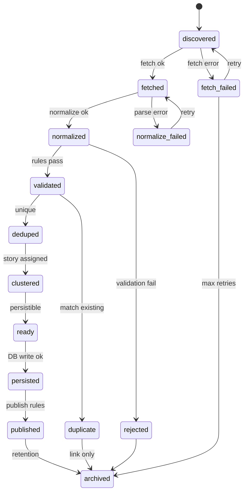
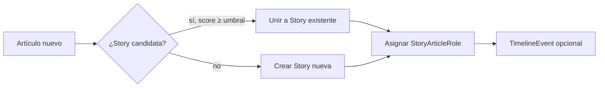

# News Ingestion Engine — diseño e implementación

> Estado: **RSS provider implementado** (discover, fetch, normalize, persist vía Supabase). Otros providers (NewsAPI, GDELT, …) siguen en diseño. Ver [`docs/news-sources.md`](news-sources.md) para el catálogo curado.

## Propósito

Obtener noticias desde **múltiples proveedores** de forma **desacoplada**, **escalable** y **tolerante a fallos**, transformándolas al modelo de dominio (`Article`, `Story`, …) sin que la aplicación dependa de un único vendor.

El Engine es la **única capa autorizada** a hablar con fuentes externas de noticias (RSS, NewsAPI, GDELT, Google News, The Guardian, Reuters, AP News, feeds propios, …).

## Principios

1. **Multi-proveedor obligatorio.** Ningún flujo crítico asume un solo backend.
2. **Provider Pattern.** Interfaz común; adapters concretos en slots aislados.
3. **Normalización única.** La app nunca consume formatos externos; solo el modelo interno normalizado y, al persistir, entidades de dominio.
4. **Fallo aislado.** Un proveedor caído no detiene el pipeline global.
5. **IA opcional y posterior.** El enriquecimiento (AI Engine) es una etapa **después** de la ingesta; nunca bloquea publicación.
6. **Idempotencia por etapa.** Re-ejecutar una etapa no debe duplicar artículos ni corromper Stories.
7. **Monolito modular hoy, microservicios mañana.** Etapas con contratos estables permiten extraer workers sin reescribir dominio.

## Separación de responsabilidades

| Pieza | Responsabilidad |
|-------|-----------------|
| `features/news` | Leer y presentar `Article` / `Story` ya persistidos |
| `features/admin` | Configurar `Source`, pausar proveedores, curar Stories |
| `lib/news-ingestion` | Facade, pipeline, registry de providers, normalización, dedupe, story clustering |
| `lib/news-ingestion/providers/*` | Adapters concretos (vacíos hasta implementación) |
| `domain/` | `Article`, `Source`, `Story`, … — **sin** conocer RSS/APIs |
| `lib/ai-engine` | Enriquecimiento opcional **después** de `Ready` / persistencia |

```
┌──────────────┐     ┌─────────────────────────┐     ┌─────────────────────┐
│ features/*   │────▶│  News Ingestion Engine  │────▶│ NewsProvider impl   │
│ (nunca HTTP  │     │  pipeline + registry    │     │ rss, newsapi, gdelt…│
│  externo)    │     │  fail-isolated          │     │ (slots vacíos)      │
└──────────────┘     └───────────┬─────────────┘     └─────────────────────┘
                                 │
                                 │ map → dominio
                                 ▼
                     ┌───────────────────────┐
                     │ Article, Story, Media…  │
                     │ (persistencia futura) │
                     └───────────┬───────────┘
                                 │ opcional, async
                                 ▼
                     ┌───────────────────────┐
                     │      AI Engine        │
                     └───────────────────────┘
```

## Ubicación prevista en el repo

```
src/lib/news-ingestion/
  types/              # contratos públicos (Provider, Pipeline, NormalizedArticle)
  errors/             # jerarquía de errores tipados
  contracts/          # NewsProvider, AbstractNewsProvider
  registry/           # ProviderRegistry
  providers/          # adapters vacíos: rss, newsapi, gdelt, guardian, …
  pipeline/           # contratos por etapa + IngestionPipeline
  normalize/          # Normalizer contract
  validation/         # ArticleValidator contract
  dedupe/             # DedupeStrategy contract
  story/              # StoryEngine contract
  persistence/        # ArticlePersister contract
  publish/            # ArticlePublisher contract
  index.ts            # API pública única
```

## Flujo completo del pipeline

Desde que un ítem entra al sistema hasta que queda listo para publicación.

```mermaid
flowchart TB
  subgraph discovery [1. Descubrimiento]
    D1[Scheduler / trigger por Source]
    D2[NewsProvider.discover]
    D3[IngestionCandidate[]]
    D1 --> D2 --> D3
  end

  subgraph fetch [2. Obtención]
    F1[NewsProvider.fetch]
    F2[ProviderPayload crudo]
    D3 --> F1 --> F2
  end

  subgraph normalize [3. Normalización]
    N1[ProviderAdapter → NormalizedArticle]
    N2[Modelo interno único]
    F2 --> N1 --> N2
  end

  subgraph validate [4. Validación]
    V1[Esquema + políticas Source]
    V2{¿Válido?}
    N2 --> V1 --> V2
    V2 -->|no| RJ[Rejected / quarantine]
  end

  subgraph dedupe [5. Dedupe]
    DD1[Fingerprints + similitud]
    DD2{¿Duplicado?}
    V2 -->|sí| DD1 --> DD2
    DD2 -->|sí| MERGE[Link / skip / merge metadata]
    DD2 -->|no| CL
  end

  subgraph cluster [6. Story Engine]
    CL[Señales de agrupación]
    ST[Asignar / crear Story]
    DD2 --> CL --> ST
    MERGE --> CL
  end

  subgraph enrich [7. Enriquecimiento opcional]
    EN{AI Engine activo?}
    ST --> EN
    EN -->|no| RD
    EN -->|sí| AI[Cola AI Engine async]
    AI --> RD
  end

  subgraph persist [8. Persistencia futura]
    RD[Ready]
    PS[Map → Article + relaciones]
    DB[(PostgreSQL / Supabase)]
    RD --> PS --> DB
  end

  subgraph publish [9. Publicación]
    PB[Reglas de publish]
    CACHE[Invalidar cache / ISR]
    FEED[Feed público]
    DB --> PB --> CACHE --> FEED
  end
```

### Etapas (descripción)

| # | Etapa | Entrada | Salida | Notas |
|---|--------|---------|--------|-------|
| 1 | **Descubrimiento** | `Source` + config del provider | `IngestionCandidate[]` | URLs/IDs candidatos sin contenido completo |
| 2 | **Obtención** | `IngestionCandidate` | `ProviderPayload` | HTTP/RSS/API; errores aislados por ítem |
| 3 | **Normalización** | `ProviderPayload` | `NormalizedArticle` | Modelo interno único; sin campos vendor-specific |
| 4 | **Validación** | `NormalizedArticle` | `ValidatedArticle` o `Rejection` | Campos obligatorios, licencia, Source activa |
| 5 | **Dedupe** | `ValidatedArticle` | decisión + metadata | Ver estrategia de duplicados |
| 6 | **Story Engine** | artículo único | `StoryAssignment` | Agrupa cobertura multi-fuente |
| 7 | **Enriquecimiento** | `Article` persistible | `AIAnalysis?` | **Opcional**, cola separada, fail-open |
| 8 | **Persistencia** | `Ready` record | entidades dominio | Repositorios; transaccional por artículo |
| 9 | **Publicación** | `Article.status` | `published` + cache | Reglas editoriales/automáticas; no depende de IA |

## Provider Pattern

### Interfaz común (conceptual)

Todo proveedor implementa el mismo contrato. La aplicación y el pipeline **solo** dependen de este contrato.

```ts
/** Identificador estable del adapter (rss, newsapi, gdelt, …). */
type ProviderId = string;

type ProviderCapability =
  | "discover"      // listar candidatos (feed, search, event stream)
  | "fetch"         // obtener un ítem por referencia del proveedor
  | "stream"        // push continuo (webhook / long poll — futuro)
  | "health_check"; // ping de disponibilidad

type NewsProvider = {
  id: ProviderId;
  displayName: string;
  capabilities: ProviderCapability[];

  /** Descubre candidatos para una Source configurada. */
  discover(input: DiscoverInput): Promise<DiscoverResult>;

  /** Obtiene payload crudo de un candidato. */
  fetch(input: FetchInput): Promise<FetchResult>;

  /** Opcional: estado del proveedor sin side effects. */
  healthCheck?(): Promise<ProviderHealth>;
};
```

### Resultados uniformes

```ts
type IngestionResult<T> =
  | { ok: true; data: T }
  | { ok: false; error: IngestionError; retryable: boolean };

type IngestionError = {
  code:
    | "provider_unconfigured"
    | "provider_unavailable"
    | "rate_limited"
    | "timeout"
    | "parse_failure"
    | "not_found"
    | "policy_violation"
    | "unknown";
  providerId: ProviderId;
  message: string;
  cause?: unknown;
};
```

### Registry

- Registro declarativo de providers disponibles (`config/providers.ts` futuro).
- Cada `Source` en catálogo referencia **qué adapter** usar (`providerId` + credenciales en infra, no en dominio).
- Añadir Reuters = nuevo archivo en `providers/reuters/` + registro; **sin** tocar pipeline ni features.

### Proveedores previstos

| ProviderId (tentativo) | Tipo | discover | fetch | Notas |
|------------------------|------|----------|-------|-------|
| `rss` | Feed | ✓ | ✓ | Atom/RSS por `Source.feedUrl` |
| `newsapi` | API agregador | ✓ | ✓ | Búsqueda + headlines |
| `gdelt` | Event stream | ✓ | ✓ | Eventos globales, alto volumen |
| `google-news` | Agregador | ✓ | ✓ | RSS/API según licencia futura |
| `guardian` | API editorial | ✓ | ✓ | The Guardian Open Platform |
| `reuters` | API wire | ✓ | ✓ | Credenciales comerciales |
| `ap-news` | API wire | ✓ | ✓ | Associated Press |
| `custom` | Interno | ✓ | ✓ | Scrapers/feeds propios bajo política |

## Modelo interno normalizado

**Regla:** ningún módulo fuera de `lib/news-ingestion/providers/*` ve el JSON/XML crudo del vendor.

### Capas de datos

```
ProviderPayload (crudo, por adapter)
        │
        ▼
NormalizedArticle (modelo interno único del Engine)
        │
        ▼
Article + Media + Reference + … (dominio, al persistir)
```

### `NormalizedArticle` (conceptual)

Representa un artículo **antes** de persistencia. No es la entidad `Article` de dominio: no tiene `ArticleId` asignado hasta persistir, pero sí campos alineados para mapping 1:1.

| Campo | Tipo | Obligatorio | Notas |
|-------|------|-------------|-------|
| `providerId` | string | ✓ | origen del adapter |
| `providerItemId` | string | ✓ | id estable en el vendor (guid, url hash, api id) |
| `sourceSlug` | string | ✓ | resuelve a `SourceId` en persistencia |
| `canonicalUrl` | Url | ✓ | URL del original |
| `urlFingerprint` | string | ✓ | hash de URL normalizada (dedupe) |
| `title` | string | ✓ | |
| `excerpt` | string | ✓ | standfirst / description permitida |
| `bodyExcerpt` | string? | | solo si licencia lo permite |
| `publishedAt` | Instant | ✓ | fecha del medio |
| `languageCode` | string | ✓ | BCP-47 → `LanguageId` |
| `countryCode` | string? | | ISO 3166-1 → `CountryId` |
| `contentFormat` | ContentFormat | ✓ | text \| image \| … |
| `byline` | string? | | |
| `paywallOriginal` | boolean | ✓ | default false |
| `heroImageUrl` | Url? | | → `Media` en persistencia |
| `references` | ReferenceDraft[] | | mín. original = canonicalUrl |
| `categories` | string[]? | | labels crudas → mapping taxonomía |
| `tags` | string[]? | | |
| `rawMetadata` | Record<string, unknown>? | | **solo** observabilidad/debug; no sale del Engine |

### `IngestionCandidate` (descubrimiento)

| Campo | Notas |
|-------|-------|
| `providerId`, `providerItemId` | clave compuesta lógica |
| `sourceSlug` | |
| `discoveredUrl` | URL para fetch |
| `discoveredAt` | |
| `hintTitle?`, `hintPublishedAt?` | metadata parcial del feed |

## Estados del pipeline

Estados de **procesamiento de ingesta** (`IngestionPipelineStatus`). Distintos de `ArticleStatus` (ciclo de vida editorial/publicación en dominio).



### Tabla de estados

| Estado | Significado | Terminal |
|--------|-------------|----------|
| `discovered` | Candidato conocido; aún sin payload | no |
| `fetched` | Payload crudo obtenido | no |
| `normalized` | Transformado a `NormalizedArticle` | no |
| `validated` | Pasó reglas de calidad y política | no |
| `rejected` | Inválido (spam, campos faltantes, Source pausada) | sí |
| `deduped` | Único en el corpus (o merge decidido) | no |
| `duplicate` | Coincide con artículo existente; no se crea nuevo | sí* |
| `clustered` | Asignado a `Story` (nueva o existente) | no |
| `ready` | Listo para persistir en dominio | no |
| `persisted` | Escrito en DB como `Article` (`status: ingested`) | no |
| `published` | Visible en feed (`Article.status: published`) | no |
| `archived` | Retirado / histórico / descartado | sí |

\* `duplicate` puede actualizar metadata del artículo canónico sin crear registro nuevo.

### Errores transitorios

| Estado | Reintento | Acción |
|--------|-----------|--------|
| `fetch_failed` | sí (backoff) | DLQ tras N intentos |
| `normalize_failed` | sí limitado | alerta + quarantine |

## Estrategia de duplicados (conceptual)

Objetivo: detectar la **misma noticia** publicada por **distintos medios** o re-publicada en la misma fuente, sin bloquear cobertura legítima multi-fuente (eso lo resuelve **Story**, no dedupe).

### Niveles de señal (orden de aplicación)

1. **Identidad fuerte — URL**
   - Normalizar URL (scheme, host, path, quitar UTM/fragmentos de tracking).
   - `urlFingerprint = hash(normalizedUrl)`.
   - Match exacto → `duplicate` (mismo artículo re-ingestado).

2. **Identidad fuerte — provider item**
   - Par `(providerId, providerItemId)` único por Source.
   - Re-ingesta idempotente del mismo ítem.

3. **Identidad media — contenido corto**
   - Simhash / MinHash sobre `title + excerpt` normalizados.
   - Ventana temporal: `publishedAt ± X horas`.
   - Match alto → candidato duplicado; revisión o auto-merge según política.

4. **Identidad débil — título + fecha**
   - Levenshtein / token overlap en títulos normalizados.
   - Solo como **señal** para Story Engine, no para descartar automáticamente cobertura de otro medio.

### Decisiones posibles al detectar duplicado

| Escenario | Acción |
|-----------|--------|
| Misma URL, misma Source | Skip; actualizar `updatedAt` / metadata |
| Misma URL, distinta Source | Raro; flag editorial |
| Distinta URL, mismo texto (syndication) | `duplicate` → apuntar al canónico |
| Distinta URL, mismo hecho (distintos medios) | **No** dedupe; **Story Engine** agrupa |

### Almacenamiento conceptual

- Índice de fingerprints (URL, simhash) — infra futura.
- Registro de decisiones (`DedupeDecision`: `skip`, `merge`, `link`, `new`) para auditoría.

## Story Engine

Agrupa **múltiples artículos** sobre el **mismo hecho** en una `Story`, habilitando timeline multi-fuente y lectura comparativa.

### Entrada

- `NormalizedArticle` / `Article` recién deduplicado.
- Catálogo de Stories activas (`developing`) en ventana temporal.

### Señales de agrupación (conceptual)

| Señal | Peso | Descripción |
|-------|------|-------------|
| Ventana temporal | alta | `publishedAt` dentro de N horas/días del cluster |
| Entidades nombradas | alta | personas, orgs, lugares compartidos (extracción futura) |
| Similitud de título | media | no idéntica (eso es dedupe) |
| País / idioma | media | mismo `primaryCountryId` |
| Provider event id | alta | p. ej. GDELT `GLOBALEVENTID` |
| Categoría editorial | baja | misma Category tentativa |
| IA sugerida | opcional | AI Engine propone cluster; editor confirma |

### Flujo



### Roles en Story (`StoryArticleRole`)

- `lead` — primer artículo o el de mayor confianza (`Source.trustTier`).
- `coverage` — cobertura adicional del mismo hecho.
- `analysis` — pieza analítica vinculada al hecho.
- `opinion_label` — opinión claramente separada (no mezclar con hechos).

### Reglas

- Preferir **una Story primaria** por artículo.
- Un artículo en varias Stories solo en casos excepcionales (aplicación/admin).
- Story no sustituye dedupe: artículos duplicados exactos no generan filas nuevas.
- Curación humana (admin) puede split/merge Stories.

## Tolerancia a fallos

### Por proveedor

- Ejecución **aislada**: scheduler lanza workers independientes por `providerId` / `Source`.
- **Circuit breaker**: tras N fallos consecutivos, pausar provider temporalmente; otros siguen.
- **Rate limiting** por adapter según ToS del vendor.
- Errores → `IngestionEvent` (log estructurado) sin abortar batch completo.

### Por ítem

- Cada candidato avanza por etapas de forma independiente.
- Reintentos con backoff exponencial en errores `retryable`.
- **Dead Letter Queue** para ítems agotados → revisión admin.

### Por etapa

| Etapa falla | Efecto en el resto |
|-------------|-------------------|
| discover (1 Source) | Otras Sources/proveedores continúan |
| fetch (1 ítem) | Otros ítems del batch continúan |
| normalize | Ítem a quarantine; pipeline sigue |
| validate | Reject solo ese ítem |
| dedupe / cluster | Fallback: artículo sin Story hasta reproceso |
| persist | Transacción por artículo; rollback local |
| AI enrich | **Ignorado** (fail-open); publish no afectado |

## Escalabilidad

Diseñado para millones de artículos, miles de fuentes, múltiples idiomas/países.

| Dimensión | Enfoque |
|-----------|---------|
| Volumen | Pipeline **asíncrono** por eventos/colas; batches configurables |
| Paralelismo | Workers por partición (`sourceId`, `country`, `language`, `providerId`) |
| Idempotencia | Claves `(providerId, providerItemId)`, `urlFingerprint` |
| Hot paths | Read models / CDN para feed; ingesta off-path |
| Multi-región | Particionar por `Country`; replicación lectura futura |
| Idiomas | Normalizer produce `languageCode`; validación por catálogo |
| Observabilidad | Métricas por etapa y provider (lag, error rate, throughput) |
| Evolución MS | Etapas = servicios candidatos: `discovery`, `fetch`, `normalize`, `dedupe`, `story`, `persist` |

### Particionado lógico (futuro)

```
ingestion.discover.{providerId}
ingestion.fetch.{sourceId}
ingestion.process.{urlFingerprint % N}
ingestion.story.{storyClusterShard}
ingestion.persist.{sourceId}
enrichment.ai.{articleId}          ← cola separada (AI Engine)
```

## Relación con AI Engine

```
Ingestion: … → ready → persist → Article (ingested)
                                      │
                                      ▼
                              [opcional] enrich job
                                      │
                                      ▼
                              AI Engine → AIAnalysis
```

- Cola de ingesta **independiente** de cola de enrichment (ADR 0002).
- Publicación (`published`) **no espera** AI.
- Story clustering puede usar señales IA como **input opcional**, nunca como requisito.

## Qué está prohibido (hoy y mañana)

- Importar `providers/rss` (u otro) desde `features/` o `app/`
- Parsear RSS/API en Route Handlers o componentes React
- Acoplar publish path a un solo proveedor
- Persistir payload crudo del vendor fuera del Engine
- Bloquear lectura pública por fallo de ingesta de una fuente

## Estado de implementación

| Pieza | Estado |
|-------|--------|
| Documentación | ✓ `architecture.md`, `domain.md`, `api.md`, ADR 0005 |
| Tipos y contratos (`src/lib/news-ingestion/`) | ✓ |
| Providers conectados (RSS) | ✓ primer provider funcional |
| Providers conectados (NewsAPI, GDELT, …) | ✗ |
| Pipeline ejecutable (RSS discover → normalize) | ✓ `RssIngestionRunner` |
| Cron, colas, HTTP, Supabase | ✗ |
