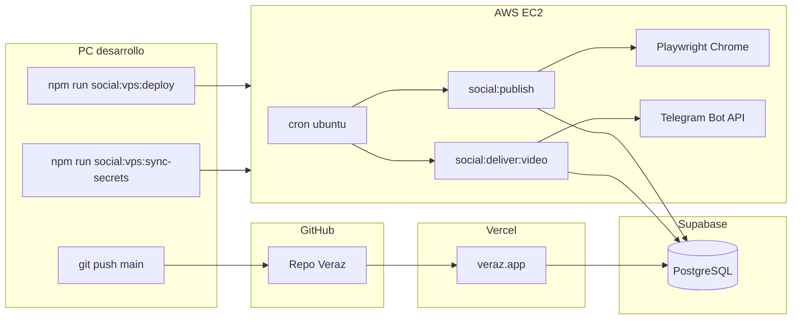

# Veraz — Descripción técnica

Documento de referencia: qué es el producto, por qué existe, cómo está construido y **qué papel juega AWS** frente a Vercel y Supabase.

---

## 1. Por qué existe Veraz

### Problema que aborda

- Consumir noticias sin perder **trazabilidad** a la fuente original.
- Evitar que la plataforma **invente hechos** o dependa de un relato generado por IA como si fuera periodismo.
- Ofrecer una experiencia de lectura **clara, rápida y multilingüe**, con agregación de medios reconocibles (Infobae, La Nación, El País, BBC Mundo, TechCrunch, CNBC, etc.).

### Propuesta de valor (producto)

**«Informar sin influenciar»**: Veraz publica titular, extracto y enlace a la noticia completa en el medio de origen. No republica el artículo entero. La IA, cuando se active, solo **enriquecería** (resumen, contexto), nunca sustituiría la fuente.

### Principios técnicos derivados

1. **Núcleo = noticias** — Feed y detalle funcionan sin IA ni APIs de modelos.
2. **Publicar nunca espera a la IA** — Ingesta y `Article.status: published` no dependen de OpenAI/Gemini/etc.
3. **Trazabilidad** — `Source`, `Reference`, atribución visible en UI y captions sociales.
4. **Modular monolith** — Un repo Next.js, boundaries claros; no microservicios prematuros.

---

## 2. Qué es Veraz (capas)

| Capa | Tecnología | Función |
|------|------------|---------|
| **Web pública** | Next.js 15 App Router, React, TypeScript, Tailwind | Landing, feed `/noticias`, artículo `[slug]`, i18n es/en |
| **Datos** | Supabase (PostgreSQL + Auth + RLS) | Artículos, fuentes, estado de publicaciones sociales |
| **Ingesta** | News Ingestion Engine (`src/lib/news-ingestion`) | RSS → normalizar → persistir |
| **Scheduler ingesta** | GitHub Actions (+ rutas cron Vercel opcionales) | Discover / run / health sobre Supabase |
| **IA (opcional)** | AI Engine (`src/lib/ai-engine`) | Contratos; default `disabled` |
| **Redes sociales** | Feature `social-publishing` + Playwright | X, IG feed; video 9:16 + Telegram |
| **Hosting web** | **Vercel** | SSR, ISR, API routes |
| **Worker social** | **AWS EC2** (Ubuntu) | Cron 24/7, Chrome, ffmpeg, xvfb |

Veraz **no es** «un bot de TikTok»: es una **plataforma de noticias** con automatización operativa en un VPS porque Vercel no puede mantener sesiones de navegador persistentes.

---

## 3. Arquitectura de software

### 3.1 Estructura del repositorio

```
src/
├── app/                 # Rutas, layouts, metadata, Route Handlers (/api/cron/…)
├── components/          # Design system (ui/), layout, marketing, analytics
├── features/            # news, social-publishing, … — casos de uso + UI de módulo
├── domain/              # Entidades puras (Article, Source, Story, …)
├── lib/                 # news-ingestion, ai-engine, social-publishing, supabase
├── config/              # Única capa que lee process.env → VerazConfig
├── i18n/                # next-intl, rutas localizadas
└── styles/              # tokens.css, tipografía, landing motion
```

**Reglas de dependencia:**

- `domain/` no importa infra ni React.
- Features no importan internals de otros features.
- IA solo vía `@/lib/ai-engine`; RSS solo vía `@/lib/news-ingestion`.
- `src/app` orquesta; no contiene lógica de negocio pesada.

### 3.2 Modelo de dominio (resumen)

- **Source** → medio (Infobae, …).
- **Article** → noticia ingerida (título, excerpt, slug, hero, categoría).
- **Media / Reference** → imagen y citas trazables.
- **Story** (diseño) → agrupación multi-fuente del mismo hecho.
- **social_publications** → idempotencia por `(article_id, platform)` con estados `posted`, `delivered`, `failed`, etc.

Detalle: `docs/domain.md`, `docs/architecture.md`.

### 3.3 News Ingestion Engine

Pipeline conceptual:

`discover → fetch → normalize → validate → dedupe → story → persist → publish`

**Implementado hoy:**

- Proveedor **RSS** (fetch XML, parse, `NormalizedArticle`).
- Persistencia en Supabase con idempotencia por URL/fingerprint.
- Jobs: `npm run ingest:discover`, `ingest:run`, `ingest:health` (GitHub Actions en prod).
- Catálogo de feeds en config (`NEWS_RSS_FEEDS` / catálogo documentado).

**No bloquea lectura:** fallo de un feed no tumba la web.

### 3.4 AI Engine (opcional)

- Modos: `disabled` | `summaries` | `context` | `full`.
- Provider pattern (OpenAI, Gemini, …) detrás de una fachada.
- `failOpen`: error de modelo → la noticia igual se publica.
- Sin SDKs en features; sin API keys obligatorias.

---

## 4. Frontend y diseño web

### 4.1 Design system

- Tokens en `src/styles/tokens.css` (color, espacio, motion).
- Tema **oscuro por defecto**.
- Componentes primitivos en `src/components/ui/`.
- Tipografía: Helvetica Now Display / Veraz Sans.

### 4.2 Experiencia destacada

- **Landing:** hero con **globo 3D** (React Three Fiber), secciones modulares, GSAP en navegación (PillNav, locale switcher).
- **Feed:** tabs por vertical, filtros por tag, banner de fuentes prestigiosas en finanzas/tecnología.
- **Artículo:** SSR, JSON-LD, hero image, referencias.
- **i18n:** `/es` y `/en` con fuentes y reglas de acceso por locale.
- **Analytics:** PostHog opcional (feature flag).

Diseño web: **Chiikö** (crédito en footer del sitio).

---

## 5. Publicación social (lógica de producto)

### 5.1 Por canal

| Canal | Cómo | Dónde corre |
|-------|------|-------------|
| **X** | PNG 1080×1080 (`hero-gradient`), Playwright, caption + enlace Veraz | AWS cron |
| **Instagram feed** | Mismo PNG; `xvfb-run` + `SOCIAL_HEADED=true` | AWS cron |
| **TikTok / Reels** | MP4 **1080×1920**, overlay Veraz + stock Pexels o fallback imagen; **Telegram** al operador; publicación manual en app | AWS cron (`social:deliver:video`) |

TikTok automático vía TikTok Studio existió en código; en producción se prefiere **entrega Telegram** (audio en app, control humano).

### 5.2 Selección de noticias (reach score)

Unificado en `social-reach-score.ts`:

- Peso por categoría (deportes, internacional, tech, …).
- Bonus: foto hero, titular con gancho, fuente tier‑1 (Infobae, La Nación, …).
- Penalización: titulares hiperlocales sin categoría de alcance.
- Umbral: `SOCIAL_MIN_REACH_SCORE=3` — si no hay candidato, el slot no publica.

Escaneo del feed en batch y **orden por score**, no FIFO ciego.

### 5.3 Generación de video

1. `renderVideoReelOverlay` → PNG transparente 9:16 (titular, fuente, logo).
2. Pexels API (`orientation=portrait`) o tarjeta `hero-gradient-vertical`.
3. **ffmpeg:** crop cover a 1080×1920, overlay, sin audio (`-an`); validación **ffprobe**.
4. Telegram: video + mensaje solo caption + notas (sonido sugerido, slug).

Scripts: `npm run social:publish`, `social:deliver:video`, `social:mark-posted`.

### 5.4 Estado en Supabase

Tabla `social_publications`: evita duplicados, cuotas diarias por plataforma, estado `delivered` para handoff Telegram.

---

## 6. Cómo usa AWS (detalle operativo)

### 6.1 Por qué AWS y no solo Vercel

| Requisito | Vercel | AWS EC2 |
|-----------|--------|---------|
| Next.js / SSR | ✅ | Posible pero no es el rol actual |
| Cron cada 1–2 h | Limitado (Hobby) | ✅ crontab usuario `ubuntu` |
| Chrome + Playwright con **perfil persistente** (cookies X/IG) | ❌ | ✅ |
| **xvfb** + ventana “headed” para Instagram | ❌ | ✅ |
| **ffmpeg** local, MP4 grandes, Telegram upload | ❌ serverless | ✅ |
| Secretos `.env.local` + `.social/*-profile` | No aplicable | ✅ vía SCP/rsync |

**División acordada:**

- **Vercel** = sitio [veraz.app](https://www.veraz.app), API de cron de ingesta (debug), despliegue continuo desde `main`.
- **Supabase** = base de datos única (web + workers leen/escriben con service role).
- **AWS EC2** = **único** ejecutor de jobs sociales 24/7.

Veraz en AWS **no** despliega la web Next en EC2 en el flujo estándar; EC2 es un **worker** que clona el mismo repo Git para ejecutar scripts Node.

### 6.2 Infraestructura EC2 (configuración típica)

| Elemento | Valor |
|----------|--------|
| SO | Ubuntu 24.04 (Noble) |
| Acceso | SSH `ubuntu@<IP>` + clave PEM |
| Código | `/home/veraz/Veraz` (git clone / `git reset --hard origin/main`) |
| Node | 22+ (install via nodesource en deploy script) |
| Binarios | Google Chrome (Playwright), ffmpeg, xvfb |
| Secretos | `.env.local` (no git), sincronizado desde PC |
| Sesiones | `.social/x-profile`, `.social/instagram-profile` (Chrome user data) |
| Logs | `.social/publish.log`, `.social/deliver-video.log` |
| Exports | `.social/exports/` (PNG, MP4, debug) |

Variables de entorno relevantes en el VPS: `SOCIAL_*`, `TELEGRAM_*`, `PEXELS_API_KEY`, `NEXT_PUBLIC_SUPABASE_URL`, `SUPABASE_SERVICE_ROLE_KEY`, etc.

### 6.3 Scripts de operación (desde PC de desarrollo)

| Comando | Acción |
|---------|--------|
| `npm run social:vps:deploy` | SSH → `git fetch`, `reset --hard`, `npm ci`, Playwright chrome, ffmpeg |
| `npm run social:vps:sync-secrets` | SCP `.env.local` + rsync perfiles `.social/*-profile` |
| `npm run social:vps:install-cron` | Instala `scripts/social-crontab.example` en crontab de `ubuntu` |

**Cron (hora servidor, `America/Mexico_City`):**

- X: minuto 0 en 7,9,11,…,23 — hasta 10/día.
- Instagram: minuto 0 en 8,11,14,17,20,23 — 6/día con xvfb.
- Telegram video: minuto **20** en 7,9,11,…,21 — hasta 8/día.

Importante: las líneas de cron usan **rutas absolutas** (`cd /home/veraz/Veraz`, logs en `.social/*.log`) porque variables `$VERAZ_DIR` no se expandían de forma fiable en el job.

### 6.4 Flujo de despliegue social



### 6.5 Ahorro y límites (AWS)

Runbook menciona **EventBridge** para start/stop de instancia (ventana activa ~7:45–21:00 CDMX) si se quiere reducir coste; los crons deben alinearse con la ventana encendida.

Límites actuales:

- Cuotas diarias por red en env + conteo en `social_publications`.
- Reach score puede dejar slots vacíos (comportamiento deseado).
- Sesiones X/IG caducan → re-login local + `sync-secrets`.
- Telegram upload puede ser lento; jobs largos vía SSH pueden timeout (el cron en la máquina no depende de SSH).

### 6.6 Qué AWS **no** hace en Veraz hoy

- No hay ECS/Lambda para social (monolito script en una VM).
- No S3 como CDN de medios sociales (archivos locales en `.social/exports`).
- No RDS propio (Supabase hosted Postgres).
- No CloudFront delante del worker (solo IP pública SSH).

Ampliable en el futuro: S3 para archivos, SSM en lugar de SCP, API oficial X/Meta para prescindir de Playwright en serverless.

---

## 7. Ingesta y web en Vercel / GitHub (complemento)

- **Build:** `next build` en Vercel; variables sincronizadas con `sync-vercel-env.sh`.
- **Ingesta prod:** GitHub Actions ejecuta CLI contra Supabase (Hobby no permite cron frecuente en Vercel).
- **Seguridad:** `CRON_SECRET` en rutas `/api/cron/ingest/*`; RLS en tablas de usuario; service role solo en servidor.

---

## 8. Stack resumido

- **TypeScript strict**, Vitest en ingesta y social score.
- **next-intl**, **Tailwind**, **sharp** (tarjetas PNG), **ffmpeg** (video).
- **Playwright** + Chrome estable.
- **Telegram Bot API** (fetch multipart).
- **PostHog** opcional.

---

## 9. Lecturas en el repo

| Documento | Contenido |
|-----------|-----------|
| `docs/vision.md` | Por qué y principios |
| `docs/architecture.md` | Capas, AI Engine, ingesta |
| `docs/news-ingestion-engine.md` | Pipeline RSS |
| `docs/social-publishing.md` | Redes, Telegram, reach |
| `docs/social-aws-runbook.md` | Comandos EC2 |
| `docs/social-vps.md` | VPS genérico vs Vercel |
| `docs/case-study-chiiko-estudio-creativo.md` | Caso estudio diseño |

---

*Veraz — descripción técnica para documentación interna y presentaciones (2026).*
